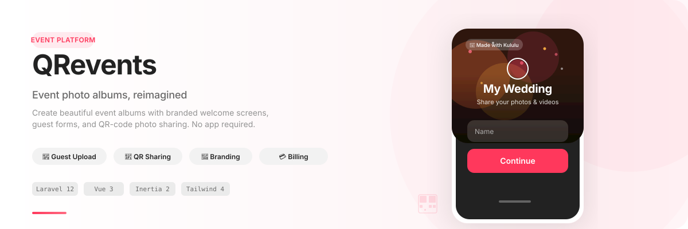
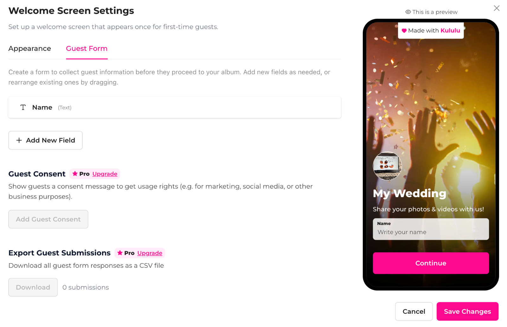
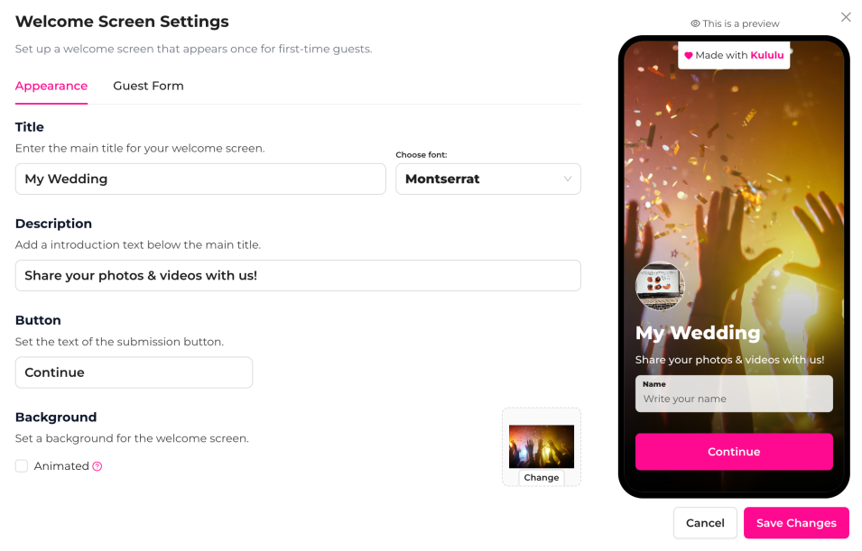

<p align="center">
  <picture>
    <source media="(prefers-color-scheme: dark)" srcset="./assets/readme/hero.svg">
    
  </picture>
</p>

<div align="center">

**Laravel 12 · Vue 3 · Inertia.js 2 · Tailwind CSS 4**

[](https://github.com/alinme/qrevents/actions/workflows/tests.yml)
[](https://github.com/alinme/qrevents/actions/workflows/deploy.yml)
[](https://php.net)
[](LICENSE)

</div>

---

## What is QRevents?

**QRevents** is a full-stack event album platform that lets event hosts create beautiful, branded photo-sharing experiences for their guests — no app download required. Guests scan a QR code to access a welcome screen, fill in their details, upload photos and videos, and relive the event.

Built by **EventSmart** (formerly "Kululu"), the platform powers everything from weddings and parties to corporate events and galas.

---

## Screenshots

<p align="center">
  
  
</p>

<p align="center">
  <em>Left: Guest form builder with custom fields · Right: Welcome screen appearance with live mobile preview</em>
</p>

---

## Key Features

### 🎨 Branded Welcome Screens
Customize the first thing guests see — title, description, font, background image or video, and call-to-action button. The live preview shows exactly how it looks on mobile.

### 📝 Guest Forms
Collect names, emails, and custom fields before guests enter the album. Optional guest consent for marketing permissions.

### 📸 Photo & Video Upload
Guests upload media directly from their phone camera or gallery. Automatic watermarking protects shared content.

### 📱 QR Code Sharing
Every event gets a unique QR code. Print it on invitations, signage, or place cards — guests scan and start sharing.

### 🎟️ Plan & Billing
Free starter plan with essentials, Pro plans for unlimited albums, guest consent, CSV exports, and premium features. Powered by Stripe.

### 👥 Collaboration
Invite co-hosts to manage the event. Business accounts can manage multiple events from one dashboard.

### 🔐 Security & Compliance
- Google & Apple OAuth login
- Two-factor authentication (2FA)
- Social login for guests via Google, Apple, Facebook
- Role-based access for admins, collaborators, and guests

---

## Tech Stack

| Layer | Technology |
|-------|-----------|
| **Backend** | PHP 8.4, Laravel 12, Laravel Fortify |
| **Frontend** | Vue 3, Inertia.js 2, TypeScript |
| **Styling** | Tailwind CSS 4, Reka UI, Lucide Icons |
| **Database** | SQLite / MySQL via Laravel |
| **Storage** | AWS S3 (League Flysystem) |
| **Payments** | Stripe |
| **Auth** | Laravel Socialite (Google, Apple, Facebook), Fortify (2FA) |
| **Testing** | Pest PHP 4, Playwright |
| **Tooling** | Vite, ESLint, Prettier, Laravel Pint |

---

## Getting Started

### Prerequisites

- PHP 8.2+
- Composer
- Node.js & npm
- Database (SQLite or MySQL)

### Installation

```bash
# Clone the repository
git clone https://github.com/alinme/qrevents.git
cd qrevents

# Install PHP dependencies
composer install

# Set up environment
cp .env.example .env
php artisan key:generate

# Configure your database in .env, then run migrations
php artisan migrate

# Install frontend dependencies
npm install
npm run build

# Start the development server
php artisan serve
npm run dev    # in a separate terminal
```

### One-command setup

```bash
composer run setup
```

---

## Development

```bash
# Start all dev services (server, queue, logs, Vite)
composer run dev

# With SSR support
composer run dev:ssr

# Lint PHP
composer run lint

# Run tests
composer run test
```

---

## Project Structure

```
resources/
├── js/
│   ├── components/       # Reusable UI components
│   ├── composables/      # Vue composables
│   ├── layouts/          # Layout components
│   ├── pages/            # Inertia page components
│   └── lib/              # Utilities (QR print drafts, invite studio)
├── css/
│   └── app.css           # Tailwind setup + design tokens

app/
├── Http/Controllers/     # Laravel controllers
├── Models/               # Eloquent models
├── Notifications/        # Email notifications
└── Actions/              # Domain actions (Fortify, etc.)
```

---

## Design System

QRevents uses an Airbnb-inspired design system:
- **Font**: [Instrument Sans](https://fonts.google.com/specimen/Instrument+Sans) (primary), Cinzel & Cormorant Garamond (invitation templates)
- **Colors**: White canvas (`#ffffff`), near-black ink (`#222222`), muted gray (`#6a6a6a`), brand accent (`#ff385c`)
- **Shadows**: Three-layer card shadow system for warm, natural elevation
- **Radius**: 8px buttons, 12–20px cards, 50% circular controls

For full details, see [DESIGN.md](./DESIGN.md).

---

## Deployment

The project includes a GitHub Actions [deploy workflow](.github/workflows/deploy.yml) that supports:
- Smart dependency installation (only when lockfiles change)
- Separate frontend-only and PHP-only deploy paths
- Queue management (PM2 / queue:restart)

See [DEPLOY_CHECKLIST.md](./DEPLOY_CHECKLIST.md) for the full deploy process.

---

## Testing

```bash
# Run all tests
php artisan test

# Run with Pest directly
./vendor/bin/pest

# Run browser tests
php artisan dusk
```

---

## Contributing

Contributions are welcome! Please review the guidelines in [AGENTS.md](./AGENTS.md) for development conventions and design rules.

---

## License

The Laravel framework and this project are open-sourced software licensed under the [MIT license](LICENSE).

---

<p align="center">
  <sub>Built with Laravel, Vue, and a lot of ❤️ · Made by EventSmart</sub>
</p>
